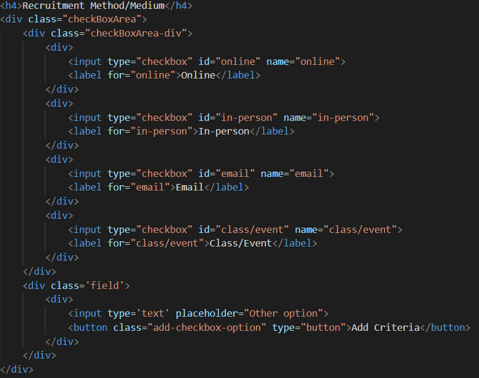
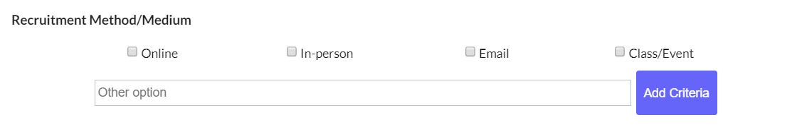
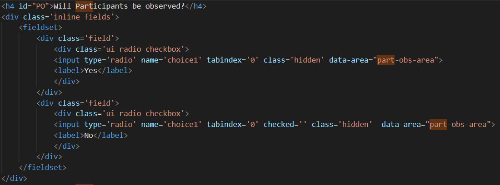
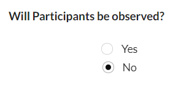

<h2>Form to make ethics applications easier</h2>
<h2>The form contains 8 components, which can be used to build certain areas of the form application</h2>
<h3>This project uses <a href="https://semantic-ui.com/">semantic ui</a> for easy design</h3>
<ul>
    <li>Components:</li>
    <li>Short input answer</li>
    <li>Group of multiple input fields</li>
    <li>Start and end date section</li>
    <li>Number input</li>
    <li>Grouped checkbox elements</li>
    <li>Inline radio fields</li>
    <li>Multiple selection dropdown</li>
</ul>

<h3>This form allows for</h3>
<ul>
    <li>PDF document generation</li>
    <li>JSON generation</li>
    <li>Continuation of partially filled in application </li>
</ul>
<a href="https://masons40.github.io/Ethics-Dashboard/">Demo Website</a>

<p>Each component is made up a H4 tag and is followed by an input area such as a DIV or INPUT tag</p>
<h3>Examples:</h3>

<h4>Example of a checkbox Area component</h4>
<p>H4 tag contains the title, also contains a field to allow the user to add more Criteria</p>
```html
<h4>Recruitment Method/Medium</h4>
<div class="checkBoxArea">
    <div class="checkBoxArea-div">
        <div>
            <input type="checkbox" id="online" name="online">
            <label for="online">Online</label>
        </div>
        <div>
            <input type="checkbox" id="in-person" name="in-person">
            <label for="in-person">In-person</label>
        </div>
        <div>
            <input type="checkbox" id="email" name="email">
            <label for="email">Email</label>
        </div>
        <div>
            <input type="checkbox" id="class/event" name="class/event">
            <label for="class/event">Class/Event</label>
        </div>
    </div>
    <div class='field'>
        <div>
            <input type='text' placeholder="Other option">
            <button class="add-checkbox-option" type="button">Add Criteria</button>
        </div>
    </div>
</div>
```
<!---->
<h5>Outputted component</h5>


<h4>Example of a radio Area component</h4>
<p>H4 tag contains the title, the No option is automatically checked</p>

<h5>Outputted component</h5>


<p>some components have field areas where usesrs can add as many options as they want( example area: group of multiple input fields)</p>
<p>A form can be made up of any mixture of components and a simple button to generate the json will be added</p>